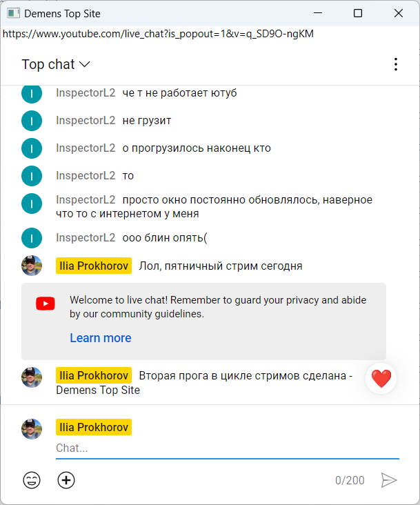

# Demens Top Site

 

## Description

Demens Top Site is a lightweight application that keeps your chosen website always visible on top of other windows. It's perfect for quick access to important information or live updates.

## Features

- **Always On Top:** Pin websites for continuous visibility.
- **Quick Access:** Instantly open favorite site.
- **Microsoft Edge Broswer Engine!**

### Install
Please visit the Releases page to stay up-to-date with the latest releases and updates:   
https://github.com/demensdeum/DemensTopSite/releases

## Hacking

1. **Download:** Clone or download the source code from [GitHub](https://github.com/DemensDeum/DemensTopSite).
2. **Open in Visual Studio:** Launch Visual Studio Community Edition.
3. **Load Solution:** Open DemensTopSite.sln.
4. **Build and Run:** Compile and run the application.
5. **Enjoy!** Experience seamless browsing with your favorite sites always on top.

### Versioning   
https://semver.org

### Donation
You can support developer by donation:   

https://www.donationalerts.com/r/demensdeum

### Language:

